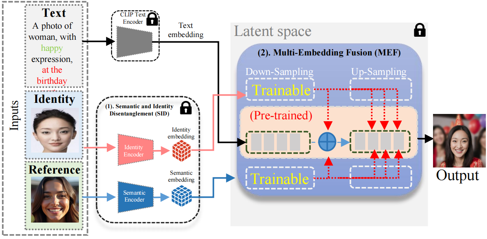
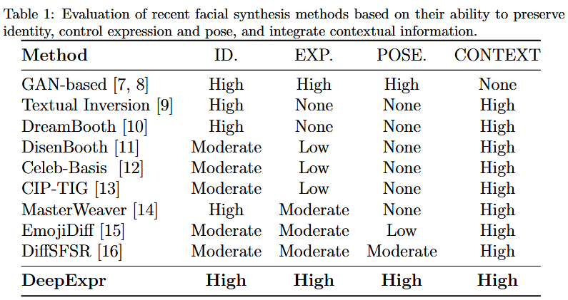
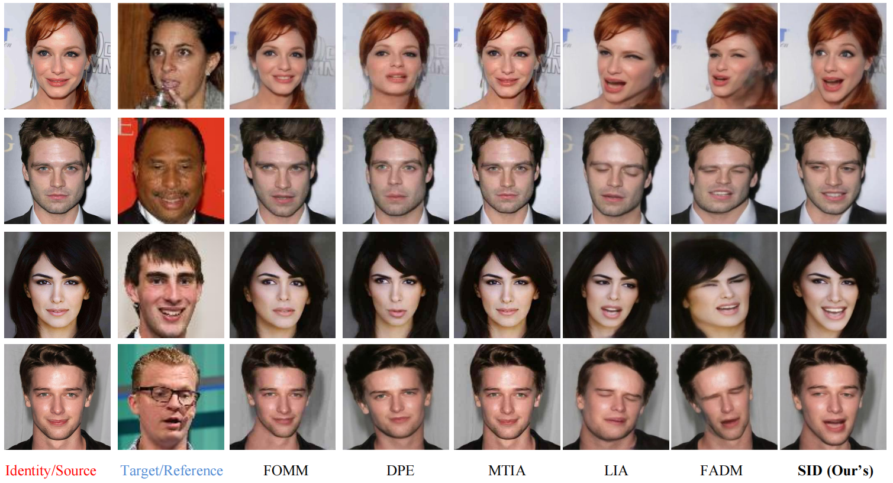
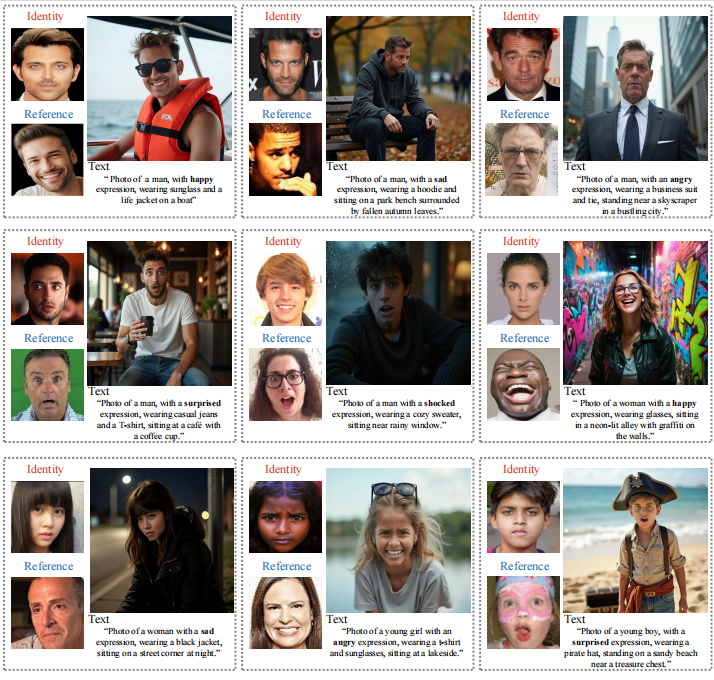
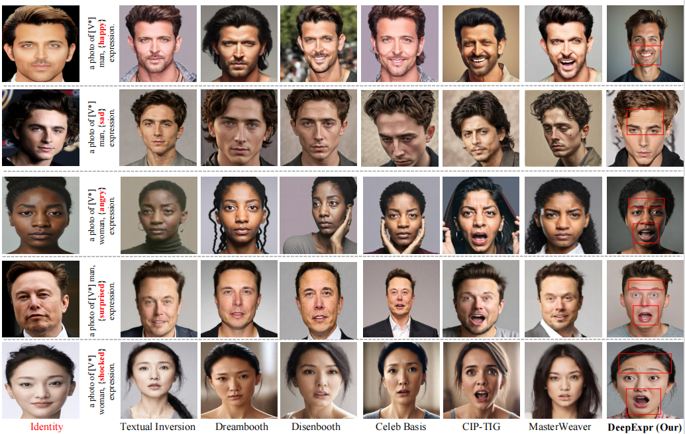
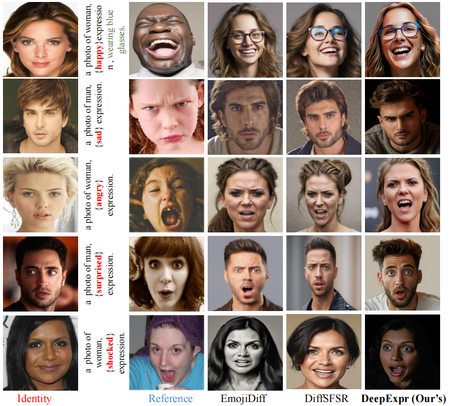

# DeepExpr: Facial Expression and Pose Generation via Self-Supervised Disentangled Embeddings Fusion in Text-to-Image Diffusion Models

---

## 📜 Abstract

Text-to-image diffusion models have shown great potential in personalized image synthesis. However, they fall short in providing a dedicated framework for human-centric tasks. Specifically, while they can successfully render a person in new textual contexts or backgrounds, they lack precise control over critical human attributes such as facial expression and head pose.

Recent efforts have attempted to bridge this gap by injecting externally learned embeddings into pre-trained text-to-image models. However, these approaches often fall short in ensuring accurate expression control and pose alignment, primarily due to the limited semantic capacity of the external embeddings. Furthermore, the direct injection of these embeddings tends to degrade facial fidelity and compromise identity preservation.

To overcome these limitations, we propose **DeepExpr**, a framework that enables precise control over facial expression and head pose while preserving identity across diverse visual contexts. DeepExpr comprises two key components:

1. **Semantic and Identity Disentanglement (SID)** — A self-supervised module leveraging frame-to-frame supervision to disentangle identity and expression representations.
2. **Multi-Embedding Fusion (MEF)** — A mechanism to integrate these embeddings into pre-trained diffusion models without degrading fidelity.

---

## 🧠 Framework Overview

<p align="center">
  
</p>

> **Figure:** Overview of the DeepExpr framework showing disentangled fusion and expression control from reference input.

---
## 🧾 Framework Comparison Table
<p align="center">  </p>
**Figure:** Evaluation of recent facial synthesis methods based on their ability to preserve identity, control expression and pose, and integrate contextual information. DeepExpr offers comprehensive control and fidelity compared to existing methods across all attributes.
## 🧪 Module-wise Results and Comparisons

### 🧩 SID Module: Identity and Semantic Disentanglement

<p align="center">
  
</p>

> **Figure:** Results from the SID module demonstrating identity preservation across expressions.

---

### 🧬 SID Evaluation: Cross-Renactment with Static and Video Driving

<p align="center">
  
</p>

> **Figure:** SID performance comparison on static image and video-based cross-expression reenactment tasks.

---

### 🌀 Inference Pipeline

<p align="center">
  
</p>

> **Figure:** End-to-end inference flow using source image and expression/pose input from video or image.

---

## ⚔️ DeepExpr vs Personalized and Expression-Centric Models

### DeepExpr vs Personalized Diffusion Models

<p align="center">
  
</p>

> **Figure:** Identity and expression consistency improvement over personalized T2I diffusion models.

### DeepExpr vs Expression Editing Methods

<p align="center">
  
</p>

> **Figure:** Expression accuracy and alignment comparison with existing expression-control techniques.

---
## 📈 Comparison with Existing Personalized and Facial Expression Models

<p align="center">
  
</p>

> **Figure:** Quantitative comparison of DeepExpr with baseline personalized and facial expression generation methods.

---

## 🔍 Reproducibility and Results

DeepExpr consistently outperforms prior models across:
- Identity preservation
- Expression accuracy
- Pose alignment

It works effectively on:
- Personalized image generation
- Emotion behavior simulation
- Forensic reconstruction using minimal supervision.

---

## 🧪 Inference Usage

### Run with Video Driving Sequence
```bash
python Inference.py --config config/dataset_name.yaml \
                    --driving_video path/to/driving.mp4 \
                    --source_image path/to/source.png \
                    --checkpoint path/to/checkpoint.pth \
                    --relative --adapt_scale
