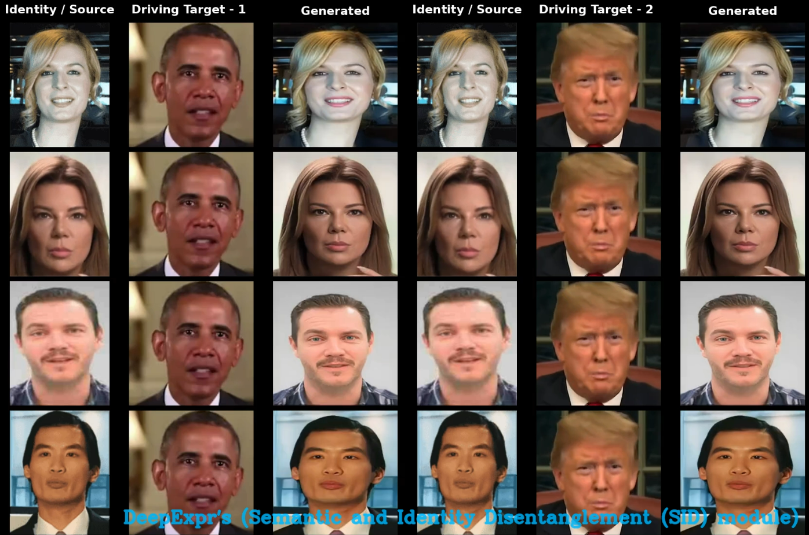
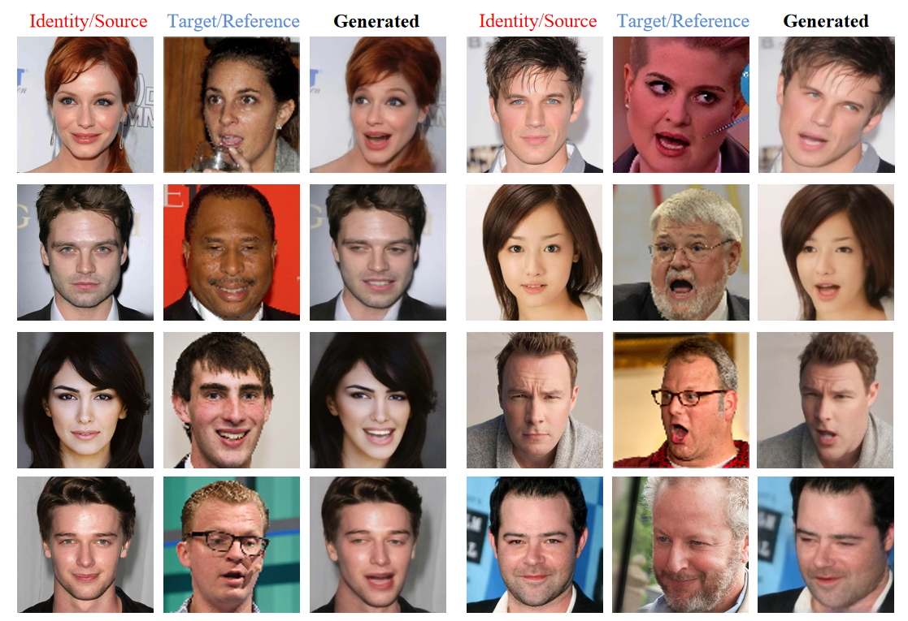

# DeepExpr

**Facial Expression and Pose Generation via Self-Supervised Disentangled Embeddings Fusion in Text-to-Image Diffusion Models**

## 🔍 Overview

**DeepExpr** addresses the limitations of existing text-to-image diffusion models in human-centric generation tasks, specifically facial expression and head pose control. While traditional models can render subjects in various textual contexts, they lack precision in manipulating key human attributes like **facial expression** and **pose** without degrading identity.

To overcome these limitations, DeepExpr introduces a two-stage solution:
- **Semantic and Identity Disentanglement (SID)** module  
- **Multi-Embedding Fusion** module

This repository includes the full implementation of the **SID module**.

---

## 🧠 Key Modules

### 1. Semantic and Identity Disentanglement (SID) Module

> 📦 `./modules/sid/`

A self-supervised module that disentangles identity and semantic attributes (such as expressions and pose) from single or paired image frames.  
It:
- Utilizes frame-to-frame supervision from static or video data
- Separates identity and expression into two independent latent spaces
- Enables composable expression and pose conditioning with identity-preserving fidelity

---

## 🖼️ Example Scenarios

### 1. Driving Video (Frame Sequence)

In this scenario, the system takes:
- **Identity image**: A single static image of the subject (first column)
- **Driving video**: A sequence of frames capturing target expressions and poses (second column)
- **Generated sequence**: SID produces a series of synthesized images (third column) with the subject’s identity, but mimicking the expressions and poses from the video frames.

📷 **Left to Right:**
1. Identity reference image  
2. Frame-by-frame driving video sequence  
3. Output: Generated image sequence with matching expressions/poses

---

## 🎬 Driving Video Example

[](Images/DEEPEXPR SID (Video as Driving).mp4)


➡️ Click the thumbnail above to watch the 10-second video showing identity preservation and expression transfer using DeepExpr.

---

### 2. Static Image Expression and Pose Transfer

This setup uses:
- **Identity image**: Static image of the subject
- **Driving image**: A single static image with a target expression and pose
- **Output**: A generated image with the subject’s identity and the driving image's expression/pose

📷 **Left to Right:**
1. Identity image  
2. Reference expression image  
3. Output: Expression-aligned synthesis

---

## 🎬 Static-Image as Reference Example

  
*Generated Image with Modified Facial Expression and Head Pose*

Both scenarios leverage the **SID module** for disentangling identity from expression/pose, ensuring identity preservation across dynamic or static conditioning inputs.

---

## Installation

We support `python3`. To install the dependencies, run:

```bash
pip install -r requirements.txt
```
## YAML Configs
There are several configuration files (config/dataset_name.yaml) for each dataset. See config/taichi-256.yaml for parameter descriptions.

## Pre-trained Checkpoints
Checkpoints can be found in the SID_Checkpoints folder as sid-adv-cpk.pth and sid-cpk.pth.

## Inference
To run inference, download the checkpoint and run:
```bash
python Inference.py \
  --config config/dataset_name.yaml \
  --driving_video path/to/driving_video_or_image \
  --source_image path/to/source_image \
  --checkpoint path/to/checkpoint \
  --relative \
  --adapt_scale
```
--driving_video can be a video file (e.g., videos/driving_video.mp4) or a single image file (e.g., images/driving_image.png).

--source_image is the identity image to preserve.

##  Example Usage
Using a video as driving input:
```bash
python Inference.py --config config/dataset_name.yaml --driving_video videos/driving_video.mp4 --source_image images/source.png --checkpoint checkpoints/model.ckpt --relative --adapt_scale

```
Using a static image as driving input:
```bash
python Inference.py --config config/dataset_name.yaml --driving_video images/driving_image.png --source_image images/source.png --checkpoint checkpoints/model.ckpt --relative --adapt_scale
```
##  Output
For video-driven inference, the generated video will be saved as result.mp4.

For static image-driven inference, the generated image will be saved as result.png.

Driving videos, driving static images, and source identity images should be cropped before use. Example inputs can be found in the Inputs/ directory:
Here is the directory structure:
~/Deep_Expr_SID_Module/Inputs/
├── driving static images/
├── driving videos/
└── Identities/
Or you can run:
```bash
python crop-video.py --inp some_youtube_video.mp4
```
